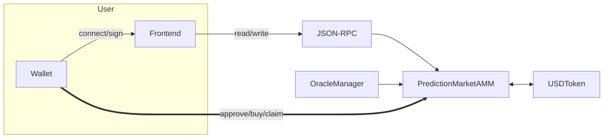

# Prediction Market MVP

A production-ready prediction market on EVM with dynamic AMM pricing, multi-signature oracle resolution, and React frontend. Users can create markets, buy YES/NO positions, and claim winnings after resolution.

## 🚀 Quick Start

### Prerequisites
- Node.js 20.19+ or 22.12+
- Foundry (forge, cast, anvil)
- Git

### Quick Verification
```bash
# Run this to check if everything is set up correctly
./scripts/verify-setup.sh
```

### 1. Clone and Setup
```bash
git clone <your-repo-url>
cd prediction-market
```

### 2. Install Dependencies
```bash
# Install contract dependencies
cd contracts
forge install OpenZeppelin/openzeppelin-contracts@v5.0.2 foundry-rs/forge-std

# Install frontend dependencies
cd ../frontend
npm install
```

### 3. Run Locally
```bash
# Terminal 1: Start local blockchain
anvil -p 8545

# Terminal 2: Deploy contracts
cd contracts
export RPC_URL=http://127.0.0.1:8545

# Generate your own private key and admin address
export PRIVATE_KEY=0x$(openssl rand -hex 32)
export ADMIN_ADDRESS=$(cast wallet address $PRIVATE_KEY)

# Deploy contracts
forge script script/Deploy.s.sol:Deploy --rpc-url $RPC_URL --broadcast
forge script script/AdminActions.s.sol:AdminActions --rpc-url $RPC_URL --broadcast

# Terminal 3: Start frontend
cd ../frontend
npm run dev
# Open http://localhost:5173
```

> ⚠️ **Troubleshooting**: If you get "Address already in use" error, stop any running Anvil processes first:
> ```bash
# Kill any existing Anvil processes
pkill -f anvil
# Then start fresh
anvil -p 8545
> ```

> ⚠️ **Security Note**: Never share your private keys! The example above generates a new key for local development only.

## 🎯 Complete Trading Workflow

### Step 4: Test the Trading System

#### 4.1 Open the Frontend
1. Open your browser and go to `http://localhost:5173`
2. You should see the prediction market interface

#### 4.2 Connect Your Wallet
1. Click "Connect Wallet" in the top right
2. Select your wallet (MetaMask, WalletConnect, etc.)
3. **Important**: Make sure you're connected to **Localhost:8545** network
4. If you don't see this network, add it manually:
   - Network Name: `Localhost`
   - RPC URL: `http://127.0.0.1:8545`
   - Chain ID: `31337`

#### 4.3 Get USDT Tokens (for testing)
```bash
# In a new terminal, mint USDT to your wallet address
cd contracts
export RPC_URL=http://127.0.0.1:8545
export TOKEN_ADDRESS=0x46415ae0dB957fd299825256F446f6bB2a1D73fd  # From deployment
export YOUR_WALLET_ADDRESS=0xf39Fd6e51aad88F6F4ce6aB8827279cffFb92266  # Replace with your address

# Mint 1000 USDT to your wallet
cast send $TOKEN_ADDRESS "mint(address,uint256)" $YOUR_WALLET_ADDRESS 1000000000 \
  --rpc-url $RPC_URL --private-key 0xac0974bec39a17e36ba4a6b4d238ff944bacb478cbed5efcae784d7bf4f2ff80
```

#### 4.4 Buy YES/NO Positions
1. **Select Market**: Click on the available market in the frontend
2. **Enter Amount**: Type amount in USDT (6 decimals, e.g., `1000000` = 1 USDT)
3. **Choose Outcome**: Select YES or NO
4. **Approve Token**: Click "Approve" to allow the contract to spend your USDT
5. **Buy Position**: Click "Buy YES" or "Buy NO"
6. **Wait for Confirmation**: Transaction will be processed on-chain

#### 4.5 Monitor Your Positions
- View your YES/NO balances for each market
- Track current prices and how they change
- Monitor the countdown to market resolution

#### 4.6 Test Market Resolution (Admin)
```bash
# Create a sample market resolution
cd contracts
export MARKET_ADDRESS=0xbf372b1B5C4094F180E92143aD83fD95759dE0C7  # From deployment

# Resolve the market (admin only)
cast send $MARKET_ADDRESS "resolve(uint256,uint8,bool)" 0 1 false \
  --rpc-url $RPC_URL --private-key $PRIVATE_KEY
```

#### 4.7 Claim Winnings
1. After market resolution, click "Claim Winnings" in the frontend
2. Receive your payout in USDT
3. Check your updated balances

### Alternative: Command-Line Trading

If you prefer terminal-based testing:

#### Buy Positions via Command Line
```bash
# Set up environment
cd contracts
export RPC_URL=http://127.0.0.1:8545
export TOKEN_ADDRESS=0x46415ae0dB957fd299825256F446f6bB2a1D73fd
export MARKET_ADDRESS=0xbf372b1B5C4094F180E92143aD83fD95759dE0C7
export USER_PRIVATE_KEY=0xac0974bec39a17e36ba4a6b4d238ff944bacb478cbed5efcae784d7bf4f2ff80

# Approve token spending
cast send $TOKEN_ADDRESS "approve(address,uint256)" $MARKET_ADDRESS 1000000000 \
  --rpc-url $RPC_URL --private-key $USER_PRIVATE_KEY

# Buy YES position (100 USDT)
cast send $MARKET_ADDRESS "buy(uint256,uint8,uint256)" 0 1 100000000 \
  --rpc-url $RPC_URL --private-key $USER_PRIVATE_KEY

# Check your balances
cast call $MARKET_ADDRESS "getBalances(uint256,address)" 0 0xf39Fd6e51aad88F6F4ce6aB8827279cffFb92266 --rpc-url $RPC_URL
```

#### Resolve and Claim via Command Line
```bash
# Resolve market (admin only)
cast send $MARKET_ADDRESS "resolve(uint256,uint8,bool)" 0 1 false \
  --rpc-url $RPC_URL --private-key $PRIVATE_KEY

# Claim winnings
cast send $MARKET_ADDRESS "claim(uint256)" 0 \
  --rpc-url $RPC_URL --private-key $USER_PRIVATE_KEY
```

## 🧪 Complete Testing Workflow

### Test the Full System

#### 1. Verify Setup
```bash
# Run the verification script
./scripts/verify-setup.sh
```

#### 2. Test Contract Deployment
```bash
# Deploy and verify contracts are working
cd contracts
forge script script/Deploy.s.sol:Deploy --rpc-url $RPC_URL --broadcast
forge script script/AdminActions.s.sol:AdminActions --rpc-url $RPC_URL --broadcast

# Check deployment
cast call $MARKET_ADDRESS "numMarkets()" --rpc-url $RPC_URL
# Should return: 0x0000000000000000000000000000000000000000000000000000000000000001
```

#### 3. Test Trading Flow
```bash
# Mint tokens to test account
cast send $TOKEN_ADDRESS "mint(address,uint256)" 0xf39Fd6e51aad88F6F4ce6aB8827279cffFb92266 1000000000 \
  --rpc-url $RPC_URL --private-key 0xac0974bec39a17e36ba4a6b4d238ff944bacb478cbed5efcae784d7bf4f2ff80

# Approve spending
cast send $TOKEN_ADDRESS "approve(address,uint256)" $MARKET_ADDRESS 1000000000 \
  --rpc-url $RPC_URL --private-key 0xac0974bec39a17e36ba4a6b4d238ff944bacb478cbed5efcae784d7bf4f2ff80

# Buy YES position
cast send $MARKET_ADDRESS "buy(uint256,uint8,uint256)" 0 1 100000000 \
  --rpc-url $RPC_URL --private-key 0xac0974bec39a17e36ba4a6b4d238ff944bacb478cbed5efcae784d7bf4f2ff80

# Check balances
cast call $MARKET_ADDRESS "getBalances(uint256,address)" 0 0xf39Fd6e51aad88F6F4ce6aB8827279cffFb92266 --rpc-url $RPC_URL
```

#### 4. Test Market Resolution
```bash
# Resolve market (admin only)
cast send $MARKET_ADDRESS "resolve(uint256,uint8,bool)" 0 1 false \
  --rpc-url $RPC_URL --private-key $PRIVATE_KEY

# Claim winnings
cast send $MARKET_ADDRESS "claim(uint256)" 0 \
  --rpc-url $RPC_URL --private-key 0xac0974bec39a17e36ba4a6b4d238ff944bacb478cbed5efcae784d7bf4f2ff80
```

#### 5. Test Frontend
1. Open http://localhost:5173
2. Connect wallet to Localhost:8545
3. Verify you can see the market
4. Test buying positions through the UI
5. Test claiming winnings after resolution

### Expected Results
- ✅ Contracts deploy successfully
- ✅ Sample market is created
- ✅ Trading works (approve → buy → claim)
- ✅ Frontend displays markets and balances
- ✅ Market resolution and claiming works
- ✅ All 27 tests pass

## 📖 How to Use

### Quick Start
- **Local Development**: See [Quick Start Guide](docs/QUICK_START.md) for 5-minute setup
- **Testnet Deployment**: Follow [Testnet Deployment Guide](TESTNET_DEPLOYMENT.md)
- **Detailed Usage**: Read the [User Guide](docs/USER_GUIDE.md)
- **Security**: Read the [Security Guide](docs/SECURITY_GUIDE.md) for secure key management

### For Users (Trading)

1. **Connect Wallet**: Click "Connect Wallet" and select your wallet
2. **Select Market**: Choose from available prediction markets
3. **Buy Positions**: 
   - Enter amount in USDT (6 decimals)
   - Select YES or NO outcome
   - Click "Approve" if needed, then "Buy"
4. **Claim Winnings**: After market resolution, click "Claim Winnings"

### For Admins (Market Creation)

1. **Create Market**: Use admin scripts to create new markets
2. **Set Oracle**: Configure oracle manager for resolution
3. **Resolve Market**: Use oracle system to resolve outcomes

## 🏗️ Architecture
- **Contracts**: Solidity with OpenZeppelin (ERC20, AccessControl, ReentrancyGuard)
- **Frontend**: React + TypeScript + wagmi/RainbowKit/viem
- **Testing**: Foundry for contracts, local Anvil for integration
- **Deployment**: Local Anvil (ready for testnet)

### Diagram

See detailed diagrams in `docs/SYSTEM_DESIGN.md`. Quick view:



Static SVG exports (for environments without Mermaid rendering):

- Architecture: `docs/diagrams/architecture.svg`
- Buy flow: `docs/diagrams/buy-sequence.svg`
- Claim flow: `docs/diagrams/claim-sequence.svg`

To regenerate SVGs locally with mermaid-cli:

```bash
npx -y @mermaid-js/mermaid-cli -i docs/diagrams/architecture.mmd -o docs/diagrams/architecture.svg
npx -y @mermaid-js/mermaid-cli -i docs/diagrams/buy-sequence.mmd -o docs/diagrams/buy-sequence.svg
npx -y @mermaid-js/mermaid-cli -i docs/diagrams/claim-sequence.mmd -o docs/diagrams/claim-sequence.svg
```

## Contract Addresses

### Local Anvil (Development)
- **USDToken**: `0x5FbDB2315678afecb367f032d93F642f64180aa3`
- **PredictionMarket**: `0xe7f1725E7734CE288F8367e1Bb143E90bb3F0512`
- **Sample Market**: ID 0 ("Will BTC > $60k by EOM?") - **RESOLVED: YES wins**

### Base Sepolia Testnet (Deployed)
- **Network**: Base Sepolia (Chain ID: 84532)
- **RPC URL**: https://sepolia.base.org
- **Block Explorer**: https://sepolia.basescan.org
- **Addresses**:
  - **USDToken**: `0x5D8ADBEbA43d97A00309dE7E5Ae629e528235a82`
  - **PredictionMarketAMM**: `0xa67B41bCF1a1885880D9f1250157dD24916385c3`
  - **OracleManager**: `0x4D7BBbaebD007c94D3D5410DD5D9c292f9b99C97`
  - **Example market IDs**: `0`

  BaseScan links:
  - USDToken: https://sepolia.basescan.org/address/0x5D8ADBEbA43d97A00309dE7E5Ae629e528235a82
  - PredictionMarketAMM: https://sepolia.basescan.org/address/0xa67B41bCF1a1885880D9f1250157dD24916385c3
  - OracleManager: https://sepolia.basescan.org/address/0x4D7BBbaebD007c94D3D5410DD5D9c292f9b99C97

## Setup & Run

### Prerequisites
- Node.js 20.19+ or 22.12+
- Foundry (forge, cast, anvil)

### 1. Contracts
```bash
cd contracts
forge install OpenZeppelin/openzeppelin-contracts@v5.0.2 foundry-rs/forge-std
forge build
forge test -vvv
```

### 2. Local Deployment
```bash
# Terminal 1: Start Anvil
anvil -p 8545

# Terminal 2: Deploy & Setup
cd contracts
export RPC_URL=http://127.0.0.1:8545
export PRIVATE_KEY=0xac0974bec39a17e36ba4a6b4d238ff944bacb478cbed5efcae784d7bf4f2ff80
export ADMIN_ADDRESS=0xF39fd6e51aad88F6F4ce6aB8827279cffFb92266
forge script script/Deploy.s.sol:Deploy --rpc-url $RPC_URL --broadcast
forge script script/AdminActions.s.sol:AdminActions --rpc-url $RPC_URL --broadcast
```

### 3. Frontend
```bash
cd frontend
npm install
npm run dev
# Open http://localhost:5173
```

Set the following env vars in `frontend/.env` before running:

```bash
VITE_TOKEN_ADDRESS=0x...
VITE_MARKET_ADDRESS=0x...
```

## 📋 Features Implemented
- ✅ Market creation with liquidity seeding
- ✅ Dynamic AMM pricing with real-time price discovery
- ✅ Buy YES/NO positions with USDT
- ✅ Multi-signature oracle resolution with dispute mechanisms
- ✅ Claim winnings/refunds
- ✅ Fee collection (1% per trade)
- ✅ Wallet connection (RainbowKit)
- ✅ Real-time balance updates
- ✅ Gas-optimized storage patterns
- ✅ Comprehensive test coverage (27 tests)

## 🎯 User Guide

### Trading on Markets

#### Step 1: Connect Your Wallet
1. Open the frontend at `http://localhost:5173`
2. Click "Connect Wallet" in the top right
3. Select your wallet (MetaMask, WalletConnect, etc.)
4. Approve the connection

#### Step 2: Select a Market
1. Browse available markets in the "Markets" section
2. Click on a market to select it
3. View market details:
   - Question/description
   - Current YES/NO prices
   - Liquidity levels
   - Trading status (open/closed)

#### Step 3: Buy Positions
1. **Enter Amount**: Type amount in USDT (6 decimals, e.g., 1000000 = 1 USDT)
2. **Select Outcome**: Choose YES or NO
3. **Approve Token**: Click "Approve" to allow the contract to spend your USDT
4. **Buy Position**: Click "Buy YES" or "Buy NO"
5. **Wait for Confirmation**: Transaction will be processed on-chain

#### Step 4: Monitor Your Positions
- View your YES/NO balances for each market
- Track current prices and liquidity
- Monitor market countdown to resolution

#### Step 5: Claim Winnings (After Resolution)
1. Wait for market resolution by oracle
2. If you have winning positions, click "Claim Winnings"
3. Receive your payout in USDT

### Admin Operations

#### Creating Markets
```bash
# Use the admin script to create markets
cd contracts
forge script script/AdminActions.s.sol:AdminActions --rpc-url $RPC_URL --broadcast
```

#### Oracle Resolution
```bash
# Add oracles
cast send $ORACLE_MANAGER "addOracle(address)" $ORACLE_ADDRESS --rpc-url $RPC_URL --private-key $PRIVATE_KEY

# Submit resolution
cast send $ORACLE_MANAGER "submitResolution(uint256,uint8,bool)" $MARKET_ID $OUTCOME $INVALID --rpc-url $RPC_URL --private-key $PRIVATE_KEY

# Finalize and push to market
cast send $ORACLE_MANAGER "finalizeResolution(uint256)" $MARKET_ID --rpc-url $RPC_URL --private-key $PRIVATE_KEY
cast send $ORACLE_MANAGER "pushResolutionToMarket(address,uint256)" $MARKET_ADDRESS $MARKET_ID --rpc-url $RPC_URL --private-key $PRIVATE_KEY
```

## Tools Used
- **AI Assistant**: Scaffolding, contract logic, frontend wiring, documentation
- **OpenZeppelin**: ERC20, AccessControl, ReentrancyGuard
- **Foundry**: Testing, deployment, local development
- **wagmi/viem**: Web3 React hooks and utilities
- **RainbowKit**: Wallet connection UI
- **Vite**: Frontend build tool

## Architecture Highlights
- **Dynamic AMM Pricing**: Constant-product formula (x*y=k) with real-time price discovery
- **Multi-Signature Oracle**: Production-ready security with dispute mechanisms and time locks
- **Gas Optimization**: Packed structs and efficient storage patterns
- **Comprehensive Testing**: 20 tests covering all functionality
- **Production Security**: ReentrancyGuard, SafeERC20, role-based access control

## Testnet Deployment

For testnet deployment to Base Sepolia, see below or [TESTNET_DEPLOYMENT.md](TESTNET_DEPLOYMENT.md).

### Step-by-step Deployment (Base Sepolia)

Prereqs:
- Base Sepolia ETH in admin wallet for gas
- Your own private key and admin address

1) Set environment variables
```bash
cd contracts
export BASE_SEPOLIA_RPC_URL=https://sepolia.base.org

# Generate your own admin address and private key
export ADMIN_ADDRESS=<your_admin_address>
export PRIVATE_KEY=<your_private_key>
# optional for verification:
export BASESCAN_API_KEY=<your_basescan_api_key>
```

> ⚠️ **Security Warning**: Never use the example private keys in production! Generate your own secure keys.

2) Deploy a basic PredictionMarket + USDToken (optional if only AMM is used)
```bash
forge script script/DeployTestnet.s.sol:DeployTestnet \
  --rpc-url $BASE_SEPOLIA_RPC_URL \
  --broadcast
```
Outputs include `USDToken` and `PredictionMarket` addresses.

3) Deploy AMM market using existing token and seed liquidity
```bash
export TOKEN_ADDRESS=0x5D8ADBEbA43d97A00309dE7E5Ae629e528235a82

# Mint some USDT to admin for initial liquidity (6 decimals; example 1,000 USDT)
cast send $TOKEN_ADDRESS "mint(address,uint256)" $ADMIN_ADDRESS 1000000000 \
  --rpc-url $BASE_SEPOLIA_RPC_URL --private-key $PRIVATE_KEY

forge script script/DeployAMM.s.sol:DeployAMM \
  --rpc-url $BASE_SEPOLIA_RPC_URL \
  --broadcast

# Resulting AMM example: 0xa67B41bCF1a1885880D9f1250157dD24916385c3 (market id 0 created)
```

4) Deploy OracleManager, wire AMM to it, and register market
```bash
forge script script/DeployOracleManager.s.sol:DeployOracleManager \
  --rpc-url $BASE_SEPOLIA_RPC_URL \
  --broadcast

export ORACLE_MANAGER=0x4D7BBbaebD007c94D3D5410DD5D9c292f9b99C97
export AMM_ADDRESS=0xa67B41bCF1a1885880D9f1250157dD24916385c3

# Set market's oracle manager
cast send $AMM_ADDRESS "setOracleManager(address)" $ORACLE_MANAGER \
  --rpc-url $BASE_SEPOLIA_RPC_URL --private-key $PRIVATE_KEY

# Register market in OracleManager so it can push final outcomes
cast send $ORACLE_MANAGER "registerMarket(address)" $AMM_ADDRESS \
  --rpc-url $BASE_SEPOLIA_RPC_URL --private-key $PRIVATE_KEY
```

5) Frontend configuration
```bash
cd ../frontend
printf "VITE_TOKEN_ADDRESS=%s\nVITE_MARKET_ADDRESS=%s\n" \
  0x5D8ADBEbA43d97A00309dE7E5Ae629e528235a82 \
  0xa67B41bCF1a1885880D9f1250157dD24916385c3 > .env

npm install
npm run dev
# Open http://localhost:5173 and connect wallet on Base Sepolia
```

6) Demo resolution (optional)
```bash
# Add two oracle voters
cast send $ORACLE_MANAGER "addOracle(address)" 0x1111111111111111111111111111111111110111 \
  --rpc-url $BASE_SEPOLIA_RPC_URL --private-key $PRIVATE_KEY
cast send $ORACLE_MANAGER "addOracle(address)" 0x2222222222222222222222222222222222220222 \
  --rpc-url $BASE_SEPOLIA_RPC_URL --private-key $PRIVATE_KEY

# Submit YES from both (market id 0)
cast send $ORACLE_MANAGER "submitResolution(uint256,uint8,bool)" 0 1 false \
  --rpc-url $BASE_SEPOLIA_RPC_URL --private-key $PRIVATE_KEY
cast send $ORACLE_MANAGER "submitResolution(uint256,uint8,bool)" 0 1 false \
  --rpc-url $BASE_SEPOLIA_RPC_URL --private-key $PRIVATE_KEY

# After dispute window, finalize and push
cast send $ORACLE_MANAGER "finalizeResolution(uint256)" 0 \
  --rpc-url $BASE_SEPOLIA_RPC_URL --private-key $PRIVATE_KEY
cast send $ORACLE_MANAGER "pushResolutionToMarket(address,uint256)" $AMM_ADDRESS 0 \
  --rpc-url $BASE_SEPOLIA_RPC_URL --private-key $PRIVATE_KEY
```

7) Verification (optional)
```bash
forge verify-contract 0x5D8ADBEbA43d97A00309dE7E5Ae629e528235a82 src/USDToken.sol:USDToken \
  --chain-id 84532 --etherscan-api-key $BASESCAN_API_KEY

forge verify-contract 0xa67B41bCF1a1885880D9f1250157dD24916385c3 src/PredictionMarketAMM.sol:PredictionMarketAMM \
  --chain-id 84532 --etherscan-api-key $BASESCAN_API_KEY \
  --constructor-args $(cast abi-encode "constructor(address,address)" $ADMIN_ADDRESS 0x5D8ADBEbA43d97A00309dE7E5Ae629e528235a82)

forge verify-contract 0x4D7BBbaebD007c94D3D5410DD5D9c292f9b99C97 src/OracleManager.sol:OracleManager \
  --chain-id 84532 --etherscan-api-key $BASESCAN_API_KEY \
  --constructor-args $(cast abi-encode "constructor(address)" $ADMIN_ADDRESS)
```

## 🔧 Troubleshooting

### Common Issues

#### Setup Issues
- **"Address already in use"**: Kill existing Anvil processes first:
  ```bash
  pkill -f anvil
  anvil -p 8545
  ```
- **"Could not read package.json"**: Make sure you're in the correct directory:
  ```bash
  cd frontend  # Not from project root
  npm run dev
  ```
- **"Command not found"**: Ensure Foundry and Node.js are installed:
  ```bash
  forge --version
  node --version
  ```

#### Frontend Issues
- **"Connect Wallet" not working**: Ensure you're on the correct network (localhost:8545 for local, Base Sepolia for testnet)
- **"Transaction failed"**: Check you have enough ETH for gas and USDT for trading
- **"Contract not found"**: Verify contract addresses in `frontend/.env` are correct

#### Contract Issues
- **"Insufficient allowance"**: Click "Approve" before buying positions
- **"Trading ended"**: Market has passed its end time
- **"Not resolved"**: Market hasn't been resolved by oracle yet

#### Deployment Issues
- **"Insufficient funds"**: Get testnet ETH from faucet
- **"RPC error"**: Check RPC URL is correct and accessible
- **"Verification failed"**: Ensure constructor arguments match deployment

### Getting Help
1. Check the logs in your terminal
2. Verify contract addresses on block explorer
3. Ensure you have the latest dependencies
4. Check network connectivity

## 🏭 Production Considerations
- **Oracle**: Multi-signature oracle with dispute mechanisms (production-ready)
- **Liquidity**: Dynamic AMM with protocol-owned liquidity
- **Security**: Multi-sig for admin roles, time-locked resolutions
- **Gas Efficiency**: Optimized storage patterns and packed structs
- **Monitoring**: Event indexing, large trade alerts
