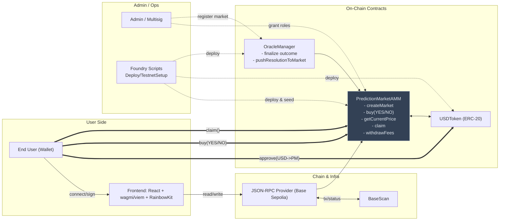
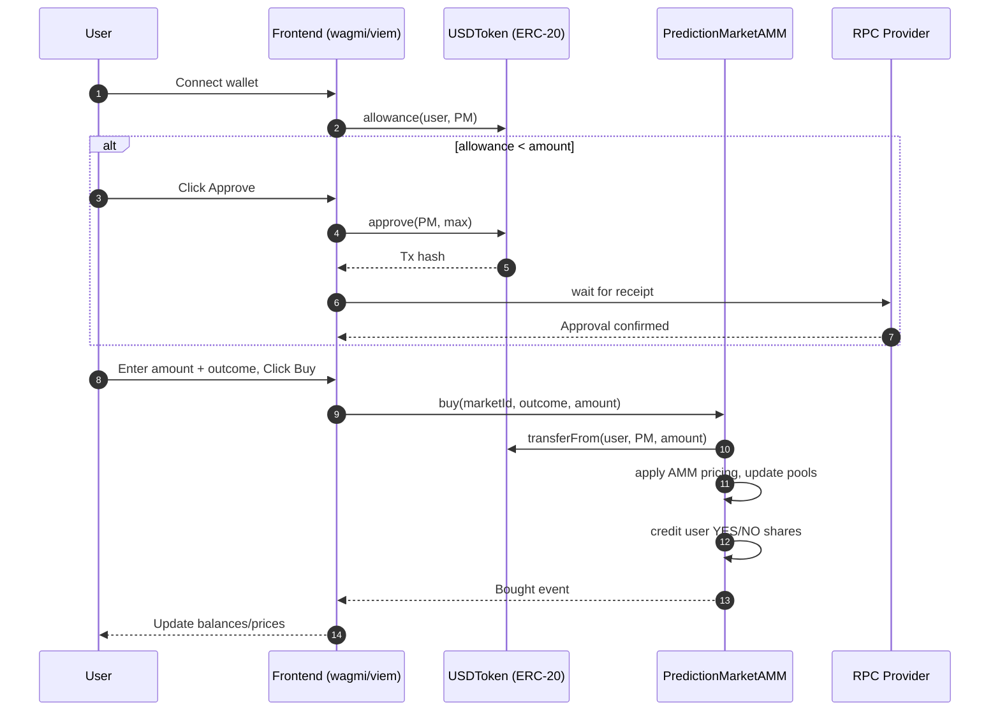
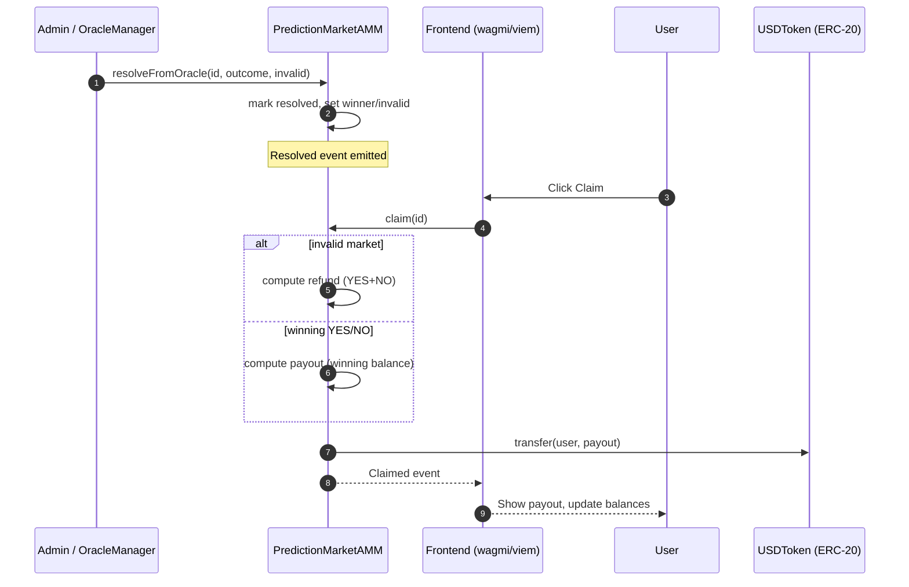

# System Design

## Overview
This is a production-ready yes/no prediction market on an EVM chain with multi-signature oracle resolution and dynamic AMM pricing. Users buy outcome shares for markets using a settlement ERC-20 token, with real-time price discovery and after resolution can claim winnings. The system prioritizes security, gas efficiency, and production-ready architecture.

## Architecture Diagram

## Key Sequences

### Buy Flow (approve + buy)

### Claim Flow (post-resolution)

## Goals and Scope
- Allow users to discover markets, buy outcome positions, and claim after resolution.
- Support market creation by an admin (MVP) with documented path to permissionless creation.
- Use an ERC-20 settlement currency (USD-like test token) to simplify UX and avoid ETH volatility.
- Implement multi-signature oracle for resolution with dispute mechanisms and time locks.

## Architecture
- On-chain
  - `USDToken` (ERC-20): Settlement token with 6 decimals, mintable by admin for testing.
- `PredictionMarketAMM`: Manages markets with dynamic AMM pricing and liquidity pools.
- `OracleManager`: Multi-signature oracle with dispute mechanisms and time locks. Now wired to markets via `resolveFromOracle` hook. Admin registers market contracts in `OracleManager`, and the oracle pushes finalized outcomes on-chain to settle markets.
  - Access control: `DEFAULT_ADMIN_ROLE`, `ORACLE_ROLE`, `LIQUIDITY_PROVIDER_ROLE`.
  - Security: Reentrancy guard, SafeERC20, checks-effects-interactions, pull-based claims.
- Off-chain
  - Direct RPC integration: The frontend reads directly from chain via RPC for real-time data.
  - Multi-signature oracle: Implemented with dispute mechanisms and time locks for production security.
- Frontend
  - Minimal UI using wagmi/RainbowKit/viem. One complete flow: connect wallet -> approve settlement token -> buy outcome -> (post-resolution) claim.

## Liquidity Model
- **Implemented**: Constant-product AMM (x*y=k) with dynamic pricing and protocol fees.
  - **Pros**: Continuous prices, no order book complexity, intuitive bonding curve, real price discovery.
  - **Cons**: Impermanent loss if LPs exist; price manipulation risk on thin liquidity.
  - **Implementation**: Protocol-owned initial liquidity with 50/50 seeding. Dynamic pricing based on AMM formula.

### AMM Details (MVP)
- Two pools per market: YES and NO share pools, backed by settlement token.
- Buying YES: user deposits settlement token; AMM mints YES shares according to price impact; settlement token added to YES pool and removed from NO pool proportionally (maintain invariant approx.).
- Simplification: Represent outcome shares as internal accounting (not ERC-20) to reduce complexity; users hold balances in `PredictionMarket`.
- Fees: A small fee (e.g., 1%) taken from input during buys; accumulated in contract as protocol fees withdrawable by admin.

**Note**: Dynamic AMM pricing is fully implemented with constant-product formula (x*y=k). Price discovery occurs in real-time based on trading activity, providing accurate market sentiment reflection. The frontend MVP targets the fixed-price market for simplicity; extending the UI to the AMM is straightforward.

## Market Lifecycle
1. Create: Admin creates a market with metadata (question, endTime, resolutionSource). Optionally seed protocol liquidity.
2. Trading: Until `endTime`, users can buy YES or NO. After `endTime`, trading halts.
3. Resolve: Multi-sig oracles vote and finalize in `OracleManager`; then `OracleManager.pushResolutionToMarket(market, id)` calls `resolveFromOracle` on the market to settle. Admin `resolve` remains available under `ORACLE_ROLE` for emergency/manual flows.
4. Claim: Users claim settlement token based on their outcome balances. Losing outcome holders receive nothing (except potential refund if invalid market).
5. Invalid: If marked invalid, refund proportional to provided amount (MVP: full refund of cost basis).

## Oracle Strategy
- MVP: Admin-controlled oracle with `ORACLE_ROLE` granted to a multi-sig or deployer.
- Production Migration:
  - Option A: Chainlink Functions/Any API with signed result and on-chain validation.
  - Option B: UMA Optimistic Oracle with dispute window.
  - Option C: Community governance vote signaling outcome.

## Key Data Structures
- Market struct
  - `id`, `question`, `endTime`, `resolved`, `winningOutcome`, `invalid`
  - Pools: `yesPool`, `noPool` (settlement token units)
  - Balances: mapping user => `yesBalance`, `noBalance`
  - Fees: `feeBps`, `protocolFeesAccrued`
- Contract-level
  - `settlementToken` address
  - Roles for admin and oracle

## Security Considerations
- Reentrancy: Guard state-mutating external functions; use pull-based claims; no external calls before effects.
- Access Control: Restricted resolution and fee withdrawal to roles; pause or halt trading via `endTime` check.
- Price Manipulation: Protocol-owned liquidity reduces LP sandwich; disable trading post-endTime; consider TWAP if using external price.
- Overflow/Underflow: Use Solidity ^0.8 checked math; safe math for fee calculations.
- Approvals: Use `safeTransferFrom` and `safeTransfer` with OZ `SafeERC20`.
- Upgradability: MVP non-upgradeable; future could use UUPS with careful storage layout.

## Gas Considerations
- Pack structs where possible; avoid redundant storage writes.
- Use internal accounting (no ERC-20 outcome tokens) to save gas.
- Emit events for off-chain indexing; avoid heavy on-chain metadata.

## Production Considerations
- Indexer/graph for efficient market lists and user positions.
- Monitoring: Alert on large trades/resolutions.
- Admin keys: Multi-sig for `ORACLE_ROLE` and admin.
- Risk: Oracle trust, thin liquidity; document known limitations.

## Known Simplifications
- Admin oracle, protocol-owned liquidity, internal balances for shares, no shorting or selling, no LPs, no order book.

## APIs and Events
- Create: `createMarket(question, endTime, feeBps, seedLiquidity)` -> `MarketCreated`
- Buy: `buy(marketId, outcome, amountIn, minSharesOut)` -> `Bought`
- Resolve: `resolve(marketId, winningOutcome, invalid)` -> `Resolved`
- Claim: `claim(marketId)` -> `Claimed`
- Admin: `withdrawFees(to, amount)` -> `FeesWithdrawn`

## Off-chain Integration
- Frontend reads:
  - Market summaries: `MarketCreated` events + contract getters.
  - User balances: getters for YES/NO balances per market.
  - Approval flow: settlement token allowance.
- Deployment: Base Sepolia; verify contracts; supply addresses in README.

## Trade-offs and Rationale

- Liquidity mechanism
  - Chosen: Constant-product AMM (x*y=k) with protocol-owned seed liquidity.
  - Alternatives: Order book (more precise price discovery, higher complexity) or hybrid (AMM baseline + RFQ/orders).
  - Rationale: AMM yields continuous prices, minimal infra, and fits MVP time constraints; avoids building matching/queue infra.

- Outcome representation
  - Chosen: Internal accounting for YES/NO balances (non-transferable).
  - Alternatives: ERC-20 outcome tokens (composability, secondary markets).
  - Rationale: Internal balances reduce gas and scope; tokens are a clear future extension once LP/secondary markets are added.

- Oracle strategy
  - Chosen: Multi-oracle manager with 2 confirmations + 24h dispute; admin-controlled roles.
  - Alternatives: UMA Optimistic Oracle, Chainlink Functions/AnyAPI with signatures, community governance votes.
  - Rationale: On-chain multi-oracle is transparent and simple for MVP; external oracles introduce infra and cost overhead.

- Governance/admin
  - Chosen: Single admin EOA for MVP; roles gated (DEFAULT_ADMIN_ROLE/ORACLE_ROLE/DISPUTE_ROLE).
  - Alternatives: Safe multisig + Timelock for role changes; parameter governance.
  - Rationale: Expedites delivery; clear migration path to Safe without storage layout changes.

## Parameters Rationale

- feeBps = 100 (1%): Small but material trading fee for protocol revenue; easy mental model.
- initial 50/50 liquidity: Neutral prior (p=0.5) and symmetric pricing to start.
- REQUIRED_CONFIRMATIONS = 2: Low-latency yet resilient to single-key compromise.
- DISPUTE_WINDOW = 24h: Provides a reasonable challenge period without undue delay.

## Operational Runbook (MVP)

- Add oracle
  - Admin calls `addOracle(oracle)` on `OracleManager` (ideally via Safe in production).
- Register market
  - Admin calls `registerMarket(market)` on `OracleManager`; market must set `oracleManager`.
- Resolve flow
  - Two oracles call `submitResolution(marketId, outcome, invalid)`.
  - After dispute window, an oracle calls `finalizeResolution(marketId)`.
  - Then call `pushResolutionToMarket(market, marketId)`.
- Dispute
  - `DISPUTE_ROLE` holder calls `disputeResolution(marketId)` during the window; votes reset and must be resubmitted.

## Future Work

- Permissionless market creation: Allow anyone to create markets, with parameter bounds and a small creator bond to discourage spam and unsafe configurations.

- ERC-20 outcome tokens and secondary markets: Tokenize YES/NO positions for composability and open trading on DEXs and other DeFi venues.

- Sell/close positions before resolution: Add an exit path so users can unwind exposure pre-resolution with slippage controls, or trade tokenized outcomes directly.

- Liquidity provider support: Let LPs deposit and withdraw liquidity, earn fees, and manage risk. Consider incentives and range/capped strategies to keep liquidity near fair odds.

- Alternative market making mechanisms: Explore LMSR/LOG, hybrid stableswap/CPMM, concentrated liquidity, v4 hooks, PMM, and batch auctions to improve capital efficiency and price discovery.

- Invalid resolution policy: Clarify invalid criteria and consider partial refunds or creator bonds to reduce griefing. Publish a simple runbook for disputes.

- Governance and safety: Migrate admin to a Safe with a Timelock and make parameter changes auditable via proposals.

- Indexing and discovery: Add a Subgraph for fast market lists, prices, volumes, and user positions to improve UX and analytics.

- Monitoring and alerting: Instrument oracle actions, large trades, low-liquidity thresholds, and failed transactions for reliability and quick incident response.

- Oracle integrations: Evaluate UMA, Chainlink Functions, or community voting as production-grade resolution options beyond the MVP oracle.
